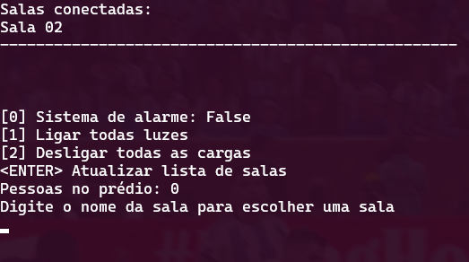
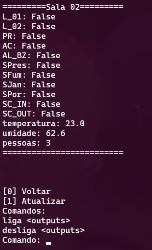

# Trabalho 1 - Automação Predial

## Central

Para rodar:

```sh
python3 main.py <ip> <porta>
```

### Menu inicial



### Menu Sala



Os códigos das saídas estão de acordo com a seguinte tabela:

| Item                    | Sigla  |
|-------------------------|:------:|
| Lâmpada 01              | L_01   |
| Lâmpada 02              | L_02   |
| Ar-Condicionado         | AC     |  
| Projetor Multimídia     | PR     |  
| Alarme/Buzzer           | AL_BZ  |

Para ligar/desligar tudo, utilize "all" no campo \<outputs>.

## Distribuído

Para rodar:

```sh
python3 main.py <config>
```

Em que \<config> é o arquivo de configuração da placa seguindo os exemplos do repositório.

## Vídeo

https://youtu.be/3YngvnBRzYY

[](https://youtu.be/3YngvnBRzYY "Apresentação")
